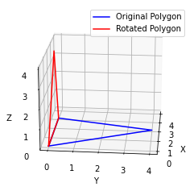
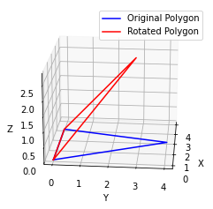

# Rotation around Segment

You will be given a set of points in 3D space. These points will define some polygon with fewer than 10 points. You will rotate the polygon a given number of degrees around the first segment of the polygon.

Let's say we have a triangle defined by these 3 points: 

```
[ (0, 0, 0), (3, 0, 0), (2, 4, 0) ]
```

The first segment is defined by:

```
[(0, 0, 0), (3, 0, 0)]
```



After rotating 90 degrees, counter-clockwise, around this segment, the triangle will have the following points: 

```
[ (0, 0, 0), (3, 0, 0), (2, 0, 4) ]
```

If we rotate the original triangle 45 degrees, we get the following triangle, rounding to the nearest hundredth: 

```
[ (0, 0, 0), (3, 0, 0), (2, 2.83, 2.83) ]
```



If we change the order of the points, the orientation changes, and rotating counter-clockwise has a different impact. For example, let's take the following triangles and rotate them 90 degrees.

```
Before:
[ (5, 0, 0), (0, 0, 0),  (3, 4, 0) ]
After Rotation:
[ (5, 0, 0), (0, 0, 0),  (3, 0, -4) ]

Before:
[ (3, 4, 0), (5, 0, 0), (0, 0, 0) ]
After Rotation:
[(3, 4, 0), (5, 0, 0), (4, 2, -4.47) ]
```

You may find the following equations helpful for rotating a point degrees around the origin: 

```
x1 = x0cos(theta) - y0sin(theta)
y1 = x0sin(theta) + y0cos(theta)
```

**Input Format**

The first line will be two integers, N R, where N is the number of points in the polygon. R is the degree that the polygon is rotated around the first segment.

There will subsequent lines of input, one for each point. Each point will be defined by 3 real numbers separated by spaces. 

N R 

x1 y1 z1

x2 y2 z2

**Constraints**

`3 <= N <= 10`

`-360 <= R <= 360`

Each coordinate (x, y, z) will between -100 and +100.

Each coordinate will have at most two decimal place accuracy provided.

**Output Format**

x1 y1 z1

x2 y2 z2

...

xn yn zn

There will be N lines, each with 3 real values that represent, in order, the points of the polygon after rotating around the first segment.

Each value will be rounded to the hundredth (2nd decimal place), and will always display two decimal places. 

**Sample Input 0**

```
3 90
0 0 0
10 0 0
5 3 3
```

**Sample Output 0**

```
0.00 0.00 0.00
10.00 0.00 0.00
5.00 -3.00 3.00
```

**Explanation 0**

The first segment is defined by (0, 0, 0) and (10, 0, 0).

Rotating around this segment will keep these two points unmoved.

Since the first segment is on the x-axis already, the rotation around the x-axis will keep the 3rd point's x & z unchanged when rotating 90 degrees. Y will be in the next quadrant, resulting in the negative value, or -3. 

**Sample Input 1**

```
4 90
0 0 0
10 0 0
5 3 3
-5 3 3
```

**Sample Output 1**

```
0.00 0.00 0.00
10.00 0.00 0.00
5.00 -3.00 3.00
-5.00 -3.00 3.00
```

**Explanation 1**

Rotating this square 90 degrees around the first segment results in another square at that location.

**Sample Input 2**

```
5 45
1 1 1
4 1 1
4 4 4
2.5 4 6
1 4 4
```

**Sample Output 2**

```
1.00 1.00 1.00
4.00 1.00 1.00
4.00 1.00 5.24
2.50 -0.41 6.66
1.00 1.00 5.24
```

**Explanation 2**

This 5 point polygon rotated 45 degrees clockwise around the first segment will keep the first segment location unchanged. The other points result from the rotation.